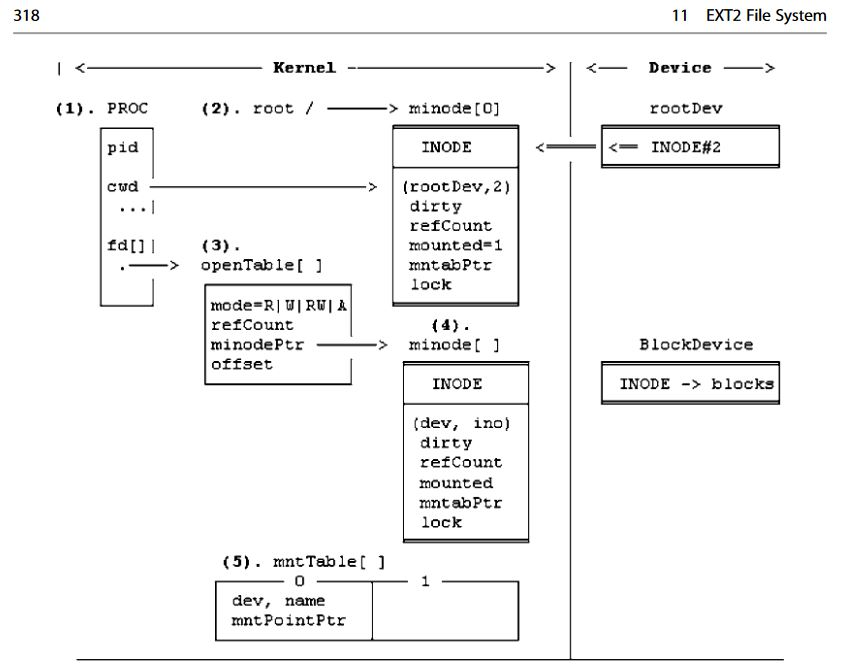

<h1 align="center">Ext2 File System</h1>

  

  

  

  

    
    
    

This project is intended to be a totally Linux-compatible ext2 file system.
The project deliverables were comprised of two primary sections. The first level
was expanding the base file system to implement the file system tree. Second level
focuses on implementing read and write operations of file contents.

# Tools Used in this Project

- C programming language
- Systems Programming in Unix/Linux Textbook
- Linux distribution (Ubuntu) used in a Virtual Machine
- Ext2 file system library
- WSU Managed Github Repository

# Development Environment

- VS Code
- Terminal
- Ubuntu Version 20.04.3-desktop

# Team / Contributors / Teachers

- [Mitchell Kolb](https://github.com/mitchellkolb)
- [Noah Waxman](https://github.com/noah-waxman)
- Professor. K.C. Wang
- [Logan Kloft](https://github.com/LoganKloft) (Teachers Assistant)

# How to Set Up

This project was implemented on our local machine inside of a virtual machine using:

- Ubuntu Version 20.04.03 found at this [link](http://lt.releases.ubuntu.com/20.04.3/).
- Clone this repository 
- Open terminal at the codebase `~.../ext2/Noah-Mitchell/`
- Run our `mk` file to create a new disk image, and then start up the file system with that new disk image mounted.
- The Ext2 File System will begin running in your terminal. 

# Commands Implemented

| Symbol | Meaning |
|----|------------------------|
| ✅ | Implemented |
| ☑️ | Partially Implemented  |
| ❌ | Not Implemented  |

## Level 1

Implements the file system. The structure is described on page 318 of the [Systems Programming Book](https://link.springer.com/book/10.1007/978-3-319-92429-8). Also as a reference, the figure is below:

<table>
    <thead>
        <tr>
            <th>Command</th>
            <th>Implemented?</th>
            <th>Description</th>
        </tr>
    </thead>
    <tbody>
         <tr>
            <th>cd</th>
            <th>✅</th>
            <th>
                Changes the directory from the current working directory to the
                new path.
            </th>
        </tr>
        <tr>
            <th>ls</th>
            <th>✅</th>
            <th>
                Lists information about the FILEs (only works for the current directory).
            </th>
        </tr>
        <tr>
            <th>pwd</th>
            <th>✅</th>
            <th>
                Prints the full filename of the current working directory.
            </th>
        </tr>
        <tr>
            <th>mkdir</th>
            <th>✅</th>
            <th>
                Creates a DIRECTORY, if they do not already exist.
            </th>
        </tr>
        <tr>
            <th>rmdir</th>
            <th>✅</th>
            <th>
                Removes the specified DIRECTORY, if its empty.
            </th>
        </tr>
        <tr>
            <th>creat</th>
            <th>✅</th>
            <th>
                Creates a FILE, if it does not already exist.
            </th>
        </tr>
        <tr>
            <th>show</th>
            <th>✅</th>
            <th>
                Prints the inode number, record length, name length, and name of each file item in the current working directory.
            </th>
        </tr>
        <tr>
            <th>hits</th>
            <th>✅</th>
            <th>
                Prints the cacheList and hit_ratio percentage.
            </th>
        </tr>
        <tr>
            <th>link</th>
            <th>☑️</th>
            <th>
                Creates a hard link to an existing file. (Bug: only works on files added when the disk image is created and not for any files created while running)
            </th>
        </tr>
        <tr>
            <th>unlink</th>
            <th>☑️</th>
            <th>
                Removes the hard link by decreasing the link count of the specified file. (Bug: only works on files added when the disk image is created and not for any files created while running)
            </th>
        </tr>
        <tr>
            <th>symlink</th>
            <th>☑️</th>
            <th>
                Creates a symbolic link that can link to DIRs and files not on the same device. (Bug: only works on files added when the disk image is created and not for any files created while running)
            </th>
        </tr>
        <tr>
            <th>exit</th>
            <th>✅</th>
            <th>
                Closes the file system process and all active file descriptors if any.
            </th>
        </tr>
    </tbody>
</table>

## Level 2

Focuses on read and write operations of files

<table>
    <thead>
        <tr>
            <th>Command</th>
            <th>Implemented?</th>
            <th>Description</th>
        </tr>
    </thead>
    <tbody>
        <tr>
            <th>open</th>
            <th>✅</th>
            <th>
                Opens a file descriptor for the specified file.
            </th>
        </tr>
        <tr>
            <th>pfd</th>
            <th>✅</th>
            <th>
                Prints the terminal all the opened file descriptors.
            </th>
        </tr>
        <tr>
            <th>close</th>
            <th>✅</th>
            <th>
                Closes a file descriptor for the specified file.
            </th>
        </tr>
        <tr>
            <th>lseek</th>
            <th>✅</th>
            <th>
                Repositions the offset of the file descriptor to the new position.
            </th>
        </tr>
        <tr>
            <th>read</th>
            <th>✅</th>
            <th>
                Reads nbytes from an opened file descriptor into a buffer area in user space.
            </th>
        </tr>
        <tr>
            <th>write</th>
            <th>☑️</th>
            <th>
                Writes nbytes from a buffer area in user space to an opened file descriptor and returns the actual number of bytes written. (Bug: Output is not saved once command completes)
            </th>
        </tr>
        <tr>
            <th>cat</th>
            <th>☑️</th>
            <th>
                Prints out the contents of the specified file until EOF is reached. (Bug: Segmenation fault for files with contents larger than 1024 bytes)
            </th>
        </tr>
        <tr>
            <th>head</th>
            <th>☑️</th>
            <th>
                Prints out the FIRST 10 lines of a file to the terminal. (Bug: Inconsistent output depending on what file is selected)
            </th>
        </tr>
            <th>tail</th>
            <th>☑️</th>
            <th>
                Prints out the LAST 10 lines of a file to the terminal. (Bug: Inconsistent output depending on what file is selected)
            </th>
        </tr>
            <th>cp</th>
            <th>❌</th>
            <th>
                Writes the contents of an existing file to a new area on the disk image, creating a duplicate of the file.
            </th>
        </tr>
            <th>mv</th>
            <th>❌</th>
            <th>
                Moves the file to a new space on current disk image or a new device entirely by creating a hard link or using the cp command if it's not the same dev.
            </th>
        </tr>        
    </tbody>
</table>
